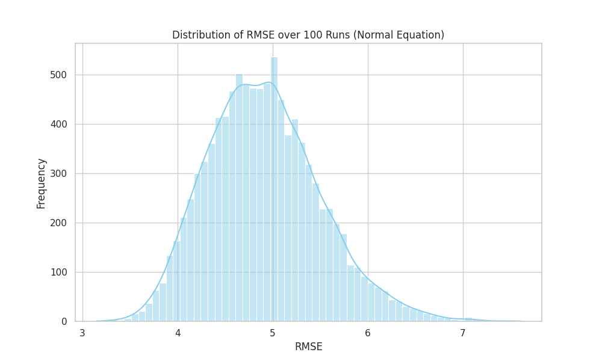
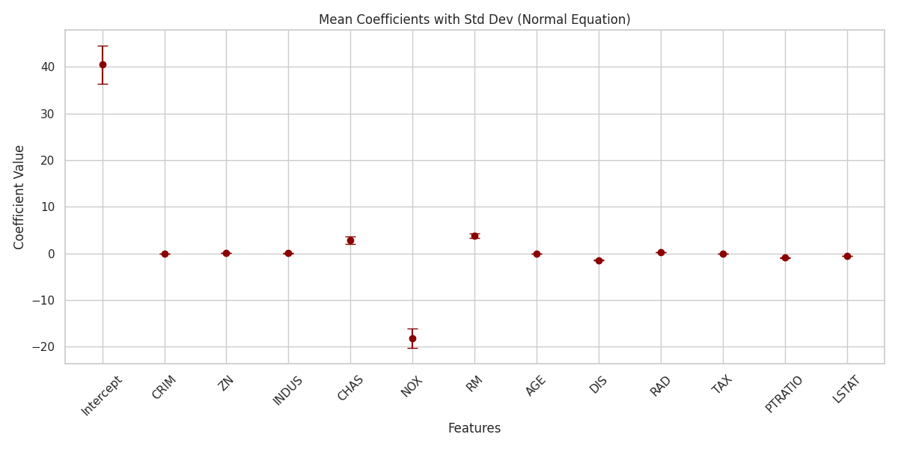
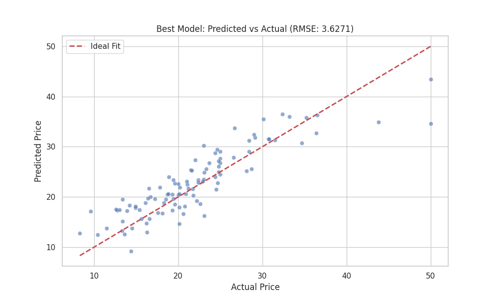
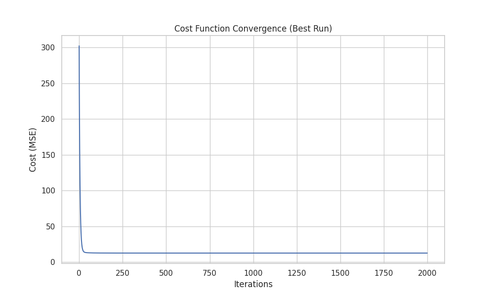
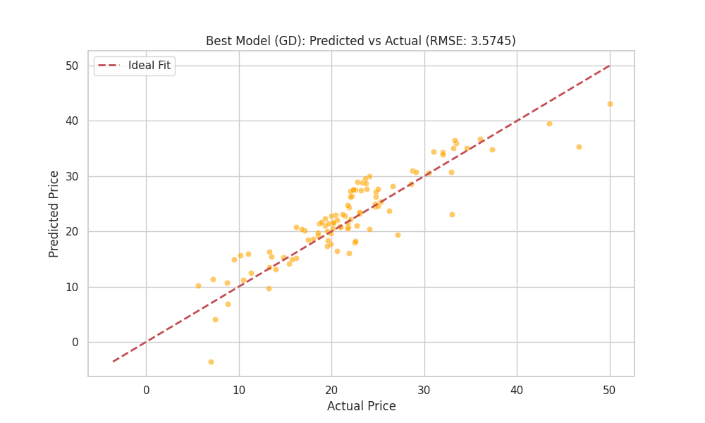
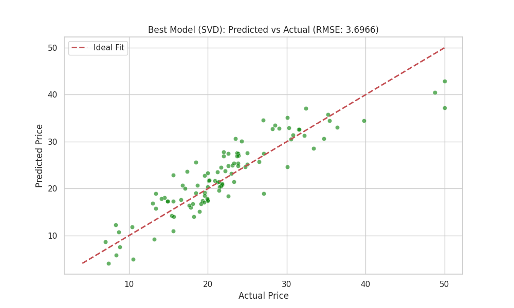
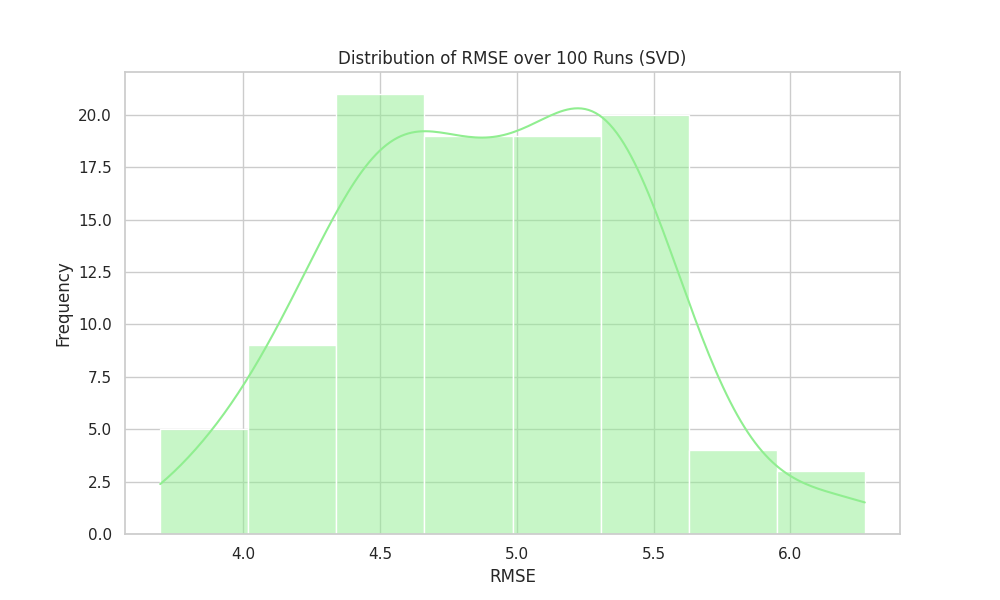

# Linear Regression Analysis Project

This project implements a **Multiple Linear Regression** model from scratch using the **Normal Equation** to predict housing prices. It performs statistical analysis by running the model multiple times on random train/test splits to evaluate model stability and performance.

## 🧠 Concepts

### 1. Multiple Linear Regression
We model the relationship between a dependent variable $y$ (target) and multiple independent variables $X$ (features) as:
$$y = \beta_0 + \beta_1 x_1 + \beta_2 x_2 + ... + \beta_n x_n + \epsilon$$

### 2. Normal Equation
Instead of using gradient descent, this project serves as an example of finding the optimal parameters $\beta$ analytically using the **Normal Equation**:
$$\beta = (X^T X)^{-1} X^T y$$
This provides the exact solution that minimizes the sum of squared errors cost function.

### 3. Statistical Validation
To ensure the results aren't biased by a single random data split, the script `run_multiple_part_2.py`:
- Performs **100 independent runs** with random 80/20 train/test splits.
- Calculates the mean and standard deviation for:
  - Root Mean Squared Error (RMSE)
  - Coefficients ($\beta$) for each feature
- Generates visualizations to analyze the distribution of errors and feature importance.

---

## 🚀 Installation & Setup

This project uses **[uv](https://github.com/astral-sh/uv)**, an extremely fast Python package and project manager.

### 1. Install uv
If you don't have `uv` installed, you can install it via the official installer script:

**Linux / macOS:**
```bash
curl -LsSf https://astral.sh/uv/install.sh | sh
```

**Windows:**
```powershell
powershell -c "irm https://astral.sh/uv/install.ps1 | iex"
```

### 2. Sync Dependencies
Navigate to the project directory and sync the environment. `uv` will automatically read `pyproject.toml`, create a virtual environment, and install all required locked dependencies.

```bash
uv sync
```

---

## 💻 Usage

To run the analysis and generate the plots, simply execute the main script using `uv run`. This ensures it runs within the correct environment.

```bash
uv run run_multiple_part_2.py
```

This will:
1. Load the dataset (`Problem2_Dataset.csv`).
2. Run the regression 100 times.
3. Print statistical summaries to the console.
4. Save the visualizations shown below to the current directory.

---

## 📊 Results & Visualizations

### 1. Model Performance (RMSE)
This histogram shows the distribution of the Root Mean Squared Error over 100 runs. A narrower distribution indicates a more stable model.


### 2. Feature Importance (Coefficients)
This plot displays the average coefficient value for equal feature. Error bars represent the standard deviation across runs, showing how much the importance of a feature varies depending on the data split.


### 3. Best Model Fit
The scatter plot below compares the **Predicted Prices** vs **Actual Prices** for the best performing run (lowest RMSE). The red dashed line represents the ideal scenario where Predicted = Actual.


---

## 🧪 Alternative Approaches (in `extra/`)

The `extra/` directory contains two alternative implementations for solving the linear regression problem: **Gradient Descent** and **Singular Value Decomposition (SVD)**.

### 1. Gradient Descent (`part2_gd.py`)
Unlike the analytical Normal Equation, Gradient Descent is an **iterative optimization algorithm**.
- **Normalization**: Features are normalized (z-score) to ensure the cost surface is spherical, allowing faster convergence.
- **Update Rule**: Iteratively updates weights $\beta$ to minimize the Mean Squared Error (MSE):
  $$ \beta := \beta - \alpha \frac{1}{m} X^T (X\beta - y) $$
  where $\alpha$ is the learning rate.

**Visualizations:**
- **Cost Convergence**: Shows how the error decreases with every iteration.

- **Model Fit**:


### 2. SVD / Pseudoinverse (`part2_svd.py`)
This method solves for $\beta$ using the **Moore-Penrose Pseudoinverse** ($X^+$), typically computed via Singular Value Decomposition:
$$ \beta = X^+ y $$
- **Stability**: This is numerically more stable than the Normal Equation, especially when matrices are singular or near-singular (multicollinearity).

**Visualizations:**
- **Model Fit**:

- **RMSE Distribution**:


---

## ⚖️ Comparison of Methods

| Feature | Normal Equation | Gradient Descent | SVD (Pseudoinverse) |
| :--- | :--- | :--- | :--- |
| **Approach** | Analytical (Exact Solution) | Iterative (Approximation) | Analytical (Exact Solution) |
| **Computational Cost** | $O(n^3)$ (Matrix Inversion) | $O(k \cdot n^2)$ (steps $\cdot$ cost) | $O(n^3)$ (SVD computation) |
| **Scalability** | Good for small/medium datasets. Slow for large feature counts ($10,000+$). | **Excellent.** Scales well with large datasets (used in Deep Learning). | Good for small/medium datasets. |
| **Stability** | Can be unstable if $X^T X$ is not invertible. | Stable if learning rate is chosen correctly. | **Most Stable.** Handles singular matrices gracefully. |
| **Feature Scaling** | Not required. | **Critical.** Requires normalization. | Not required. |

