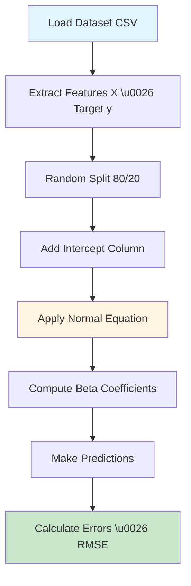
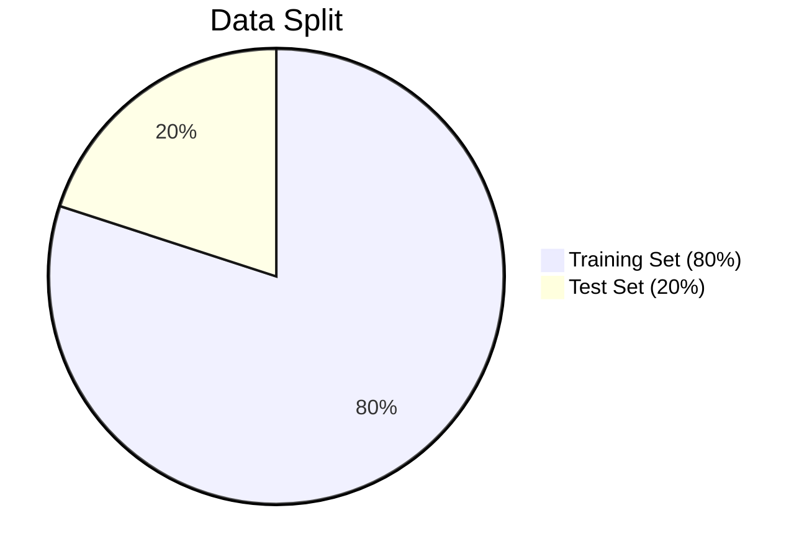
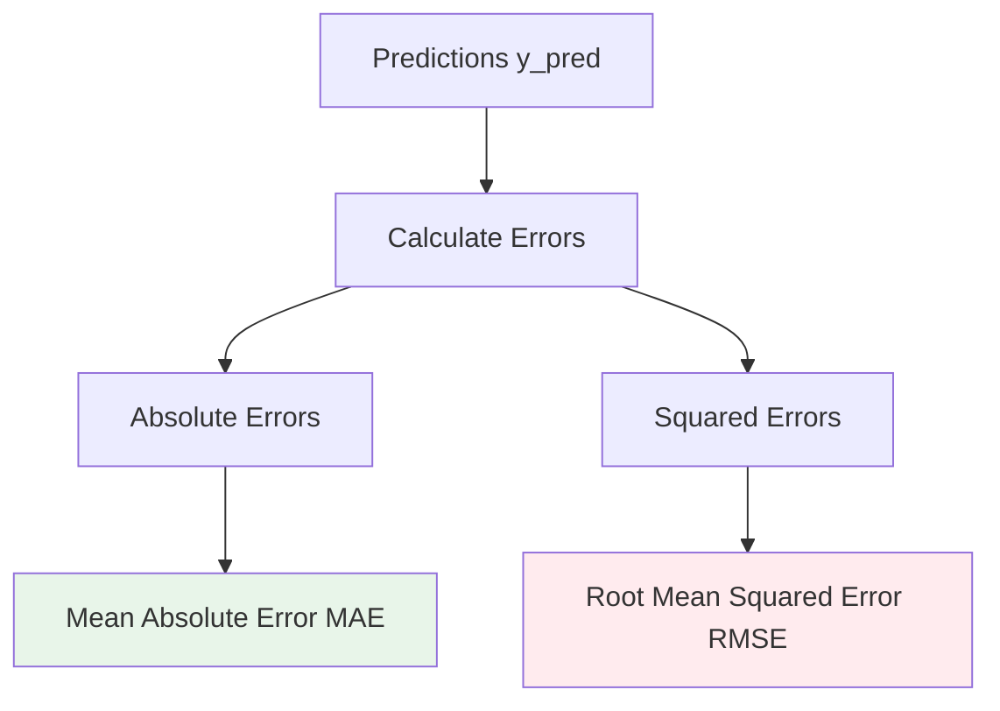
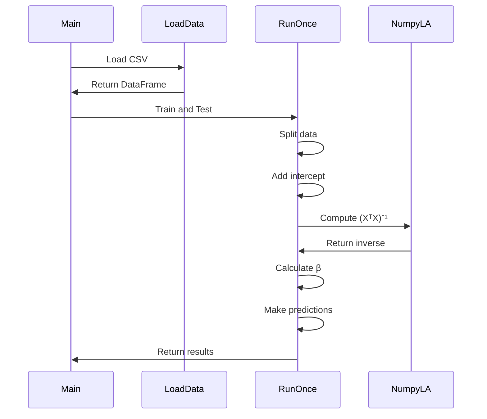
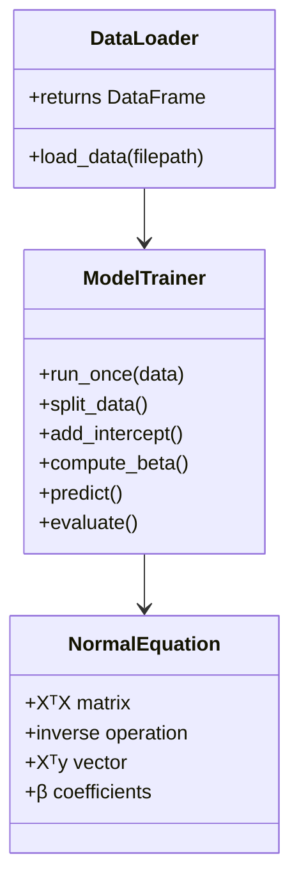

# Part 2 Explained: Linear Regression with Normal Equation

## High-Level Overview

This Python script implements **Linear Regression** using the **Normal Equation** (closed-form solution) to predict housing prices. It uses the Boston Housing dataset with 12 features to predict the median value of homes.

### Key Concept
Linear regression models the relationship between features (X) and target (y) as a linear combination. The Normal Equation provides an analytical solution to find the best-fitting parameters without using iterative optimization like gradient descent.

---

## Workflow Diagram



---

## Step-by-Step Explanation

### 1. **Data Loading**
```python
def load_data(filepath="Problem2_Dataset.csv"):
    return pd.read_csv(filepath)
```
- Loads Boston Housing dataset from CSV file
- Returns pandas DataFrame with features and target

### 2. **Features Used**
```python
FEATURES = [
    "CRIM",     # Per capita crime rate
    "ZN",       # Proportion of residential land
    "INDUS",    # Proportion of non-retail business
    "CHAS",     # Charles River dummy variable
    "NOX",      # Nitric oxides concentration
    "RM",       # Average number of rooms
    "AGE",      # Proportion of old units
    "DIS",      # Distance to employment centers
    "RAD",      # Accessibility to highways
    "TAX",      # Property tax rate
    "PTRATIO",  # Pupil-teacher ratio
    "LSTAT"     # % lower status population
]
```
- 12 input features describing housing characteristics
- Target: Median home value

### 3. **Train-Test Split**
```python
indices = np.random.permutation(len(data))
split = int(0.8 * len(data))

train_x = x[indices[:split]]
test_x = x[indices[split:]]
```



- **Random permutation**: Shuffles data to avoid bias
- **80/20 split**: 80% for training, 20% for testing
- Ensures model evaluation on unseen data

### 4. **Adding Intercept Term**
```python
train_x = np.hstack([np.ones((train_x.shape[0], 1)), train_x])
test_x = np.hstack([np.ones((test_x.shape[0], 1)), test_x])
```

**Why add intercept?**
- Allows the model to have a non-zero baseline
- Mathematically: `y = β₀ + β₁x₁ + β₂x₂ + ... + βₙxₙ`
- β₀ is the intercept (bias term)

---

## Mathematical Foundation

### The Linear Regression Model

```
y = Xβ + ε
```

where:
- **y**: Target values (n × 1)
- **X**: Feature matrix (n × (p+1)) with intercept
- **β**: Coefficients (p+1 × 1)
- **ε**: Error term

### Normal Equation

The closed-form solution to minimize the residual sum of squares:

```
β = (XᵀX)⁻¹Xᵀy
```

**Derivation** (for oral exam):
1. Loss function: `L(β) = ||y - Xβ||²`
2. Minimize by taking derivative: `∂L/∂β = 0`
3. Solve: `XᵀXβ = Xᵀy`
4. Result: `β = (XᵀX)⁻¹Xᵀy`

### Implementation
```python
beta = np.linalg.inv(train_x.T @ train_x) @ (train_x.T @ train_y)
```

**Steps**:
1. `XᵀX`: Compute Gram matrix
2. `(XᵀX)⁻¹`: Invert the matrix
3. `Xᵀy`: Compute correlation vector
4. Final multiplication: Get β coefficients

---

## Prediction and Evaluation

### Making Predictions
```python
y_pred = test_x @ beta
```
- Matrix multiplication: Each prediction is weighted sum of features
- Formula: `ŷᵢ = β₀ + β₁x₁ᵢ + β₂x₂ᵢ + ... + β₁₂x₁₂ᵢ`

### Error Metrics



#### 1. **Errors**
```python
errors = y_pred - test_y
```
- Difference between predicted and actual values
- Positive: Over-prediction, Negative: Under-prediction

#### 2. **Absolute Errors**
```python
abs_errors = np.abs(errors)
```
- Magnitude of error regardless of direction

#### 3. **Root Mean Squared Error (RMSE)**
```python
rmse = np.sqrt(np.mean(errors**2))
```

Formula:
```
RMSE = √(1/n Σ(yᵢ - ŷᵢ)²)
```

**Why RMSE?**
- Penalizes large errors more than small errors
- Same units as target variable
- Standard metric for regression evaluation

#### 4. **Mean Absolute Error (MAE)**
```python
mae = np.mean(abs_errors)
```

Formula:
```
MAE = 1/n Σ|yᵢ - ŷᵢ|
```

---

## Algorithm Flow



---

## Key Mathematical Concepts for Oral Exam

### 1. **Normal Equation vs Gradient Descent**

| Aspect | Normal Equation | Gradient Descent |
|--------|-----------------|------------------|
| **Type** | Analytical/Closed-form | Iterative |
| **Speed** | Fast for small datasets | Better for large datasets |
| **Complexity** | O(n³) due to matrix inversion | O(kn²) for k iterations |
| **Hyperparameters** | None | Learning rate, iterations |
| **Advantages** | Exact solution, no tuning | Scales to large data |
| **Disadvantages** | Slow for large features | Requires tuning |

### 2. **Matrix Operations**

**Transpose**: `XᵀX` creates a square matrix
- Shape: (p+1) × (p+1)
- Symmetric and positive semi-definite

**Inverse**: `(XᵀX)⁻¹` exists when:
- Columns of X are linearly independent
- No perfect multicollinearity
- n \u003e p (more samples than features)

### 3. **Interpreting Coefficients**

Each β coefficient represents:
- **Change in target** for one-unit change in feature
- **Holding all other features constant**

Example:
- If β_RM = 3.5, each additional room increases price by $3,500

---

## Advantages and Limitations

### ✅ Advantages
- **Exact solution**: No need for iterative optimization
- **No hyperparameters**: No learning rate to tune
- **Fast for small data**: Efficient with \u003c10,000 features

### ❌ Limitations
- **Computational cost**: O(n³) for matrix inversion
- **Memory intensive**: Requires storing XᵀX matrix
- **Numerical stability**: Can fail if XᵀX is singular
- **Not scalable**: Impractical for very large datasets

---

## Code Structure Diagram



---

## Key Takeaways for Oral Exam

### 🎯 Core Concepts
1. **Linear regression** models linear relationships between features and target
2. **Normal Equation** provides closed-form solution: `β = (XᵀX)⁻¹Xᵀy`
3. **Intercept term** allows non-zero baseline prediction
4. **RMSE** measures average prediction error

### 📊 Mathematical Understanding
- Understand matrix dimensions: X (n × p+1), β (p+1 × 1), y (n × 1)
- Know why we compute `(XᵀX)⁻¹`: Least squares optimization
- Can explain: Adding intercept, train-test split, error metrics

### 💡 Practical Considerations
- **When to use**: Small to medium datasets (\u003c10,000 features)
- **Feature scaling**: Not required for Normal Equation
- **Regularization**: Can add to prevent overfitting (Ridge regression)

### 🔍 Why It Works
- **Least squares**: Minimizes sum of squared residuals
- **Analytical solution**: Derivative of loss equals zero
- **Statistical interpretation**: Maximum likelihood estimator under Gaussian noise

---

## Quick Reference: Key Formulas

| Concept | Formula | Purpose |
|---------|---------|---------|
| Model | y = Xβ + ε | Linear relationship |
| Normal Equation | β = (XᵀX)⁻¹Xᵀy | Optimal coefficients |
| Prediction | ŷ = Xβ | Estimated values |
| RMSE | √(1/n Σ(y - ŷ)²) | Root mean squared error |
| MAE | 1/n Σ\|y - ŷ\| | Mean absolute error |

---

## Dataset Information

- **Name**: Boston Housing Dataset
- **Samples**: ~506 houses
- **Features**: 12 characteristics
- **Target**: Median home value (in $1000s)
- **Split**: 80% training, 20% testing

---

## Summary

This implementation demonstrates **linear regression using the Normal Equation**, a fundamental machine learning technique. By finding the optimal coefficients through matrix operations rather than iterative optimization, we get an exact solution efficiently. The method shows how **linear algebra** directly solves a statistical learning problem.

**Key insight**: When the number of features is manageable, the Normal Equation provides a simple, elegant solution to linear regression without the complexity of gradient-based optimization.
